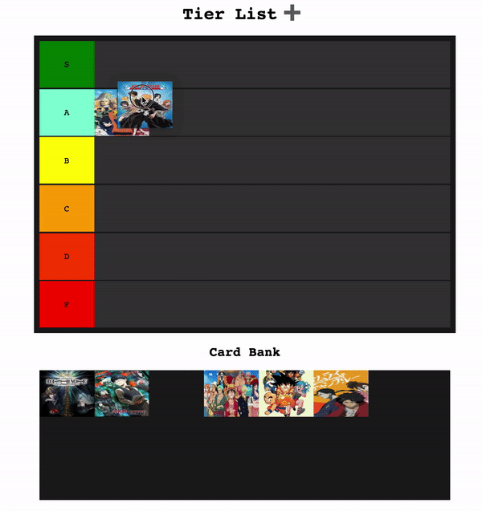

<h1 align="center">Vanilla JS Tier List</h1>

Tier List made with vanilla JavaScript

  

## Contents
* [Drag and Drop API](https://developer.mozilla.org/en-US/docs/Web/API/HTML_Drag_and_Drop_API)
* [DataTransfer API](https://developer.mozilla.org/en-US/docs/Web/API/DataTransfer)
* [DOM API](https://developer.mozilla.org/en-US/docs/Web/API/Document_Object_Model)
* [Flexbox](https://developer.mozilla.org/en-US/docs/Learn/CSS/CSS_layout/Flexbox)
* [LocalStorage](https://developer.mozilla.org/en-US/docs/Web/API/Window/localStorage)